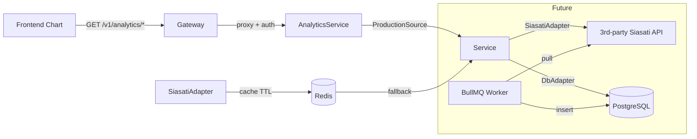

# Feature: Chart Data API (Analytics Service)

## Tujuan

Menyediakan backend API untuk chart **Kedatangan per Matra dan Moda**.
Saat ini data masih berasal dari 3rd party (Siasati), dan akan dimigrasikan ke database internal setelah arsitektur dan pipeline stabil.

## Service yang Dipakai

`analytics-service` — service baru di bawah `apps/analytics-service`.
Alasan:
- Domain data/analytics berbeda dari auth, user, dan notification.
- Bisa berdiri sendiri, scalable, dan diganti sumber datanya tanpa mengubah contract API.
- Gateway tetap sebagai thin proxy dan entry point tunggal.

## Arsitektur Komunikasi Antar Service



- **Synchronous HTTP:** `Client -> Gateway -> analytics-service -> 3rd-party / DB`.
- **Adapter pattern:** service tidak tahu sumber data. Nanti cukup ganti adapter dari `SiasatiAdapter` ke `DbAdapter`.
- **Redis cache:** untuk mengurangi panggilan ke 3rd party dan mempercepat response chart.
- **Asynchronous ingestion (future):** BullMQ worker mengambil data dari Siasati secara periodik dan menulis ke PostgreSQL.

## Struktur Folder

```
apps/
  analytics-service/
    src/
      app.ts
      index.ts
      config/
        env.ts               # SIASATI_API_URL, SIASATI_USERNAME, SIASATI_PASSWORD, REDIS_URL
      modules/
        analytics/
          ports/
            production-source.port.ts
          adapters/
            siasati.adapter.ts
            cache.adapter.ts
            db.adapter.ts    # stub / future implementation
          service/
            analytics.service.ts
          controller/
            analytics.controller.ts
          route/
            analytics.route.ts
          validator/
            analytics.validator.ts
        ingestion/           # future worker for DB migration
          queue/
            siasati.queue.ts
          worker/
            siasati.worker.ts
      test/
        health.test.ts
        analytics.route.test.ts
    package.json
    tsconfig.json

packages/shared/
  src/types/analytics.ts     # shared DTO: Produksi, ProduksiPertitik, TitikPantau, Event, Payload
```

## API Contract

```
GET /v1/analytics/arrivals
  ?eventId=123
  &provinceId=32
  &from=2025-04-21
  &to=2025-05-20
  &granularity=day   # day | hour
```

Response sesuai `ApiResponse<T>` dari `packages/shared`:

```json
{
  "data": {
    "labels": ["2025-04-21", "2025-04-22"],
    "datasets": [
      { "label": "darat", "data": [...] },
      { "label": "laut", "data": [...] },
      { "label": "udara", "data": [...] },
      { "label": "ka", "data": [...] }
    ]
  },
  "error": null,
  "meta": {
    "code": 200,
    "status": "SUCCESS",
    "message": "OK",
    "version": "v1"
  }
}
```

## Roadmap Migrasi

1. **Phase 1 (now):** `SiasatiAdapter` + Redis cache. Frontend can consume data immediately.
2. **Phase 2:** Add `IngestionWorker` (BullMQ) that pulls from Siasati and writes to PostgreSQL.
3. **Phase 3:** Switch default adapter to `DbAdapter`. Keep `SiasatiAdapter` as optional fallback.

## Mapping dari Kode Lama

| Legacy Function | New Location |
|-----------------|--------------|
| `getSiasatiProduksi` | `SiasatiAdapter.getProduction()` |
| `getSiasatiProduksiPertitik` | `SiasatiAdapter.getProductionPerPoint()` |
| `getSiasatiDataPantau` | `SiasatiAdapter.getMonitoringPoints()` |
| `Payload` | `analytics.validator.ts` (Zod) |
| File cache `fs-extra` | Redis cache with TTL |
| Retry loop | BullMQ retry or `fetchWithTimeout` |

## Security Notes

- Siasati credentials (`strategihub` / `skdio349asewkpse`) must live in `.env` only.
- Do not log `Authorization` headers or PII.
- Cache in Redis, not in local filesystem.
