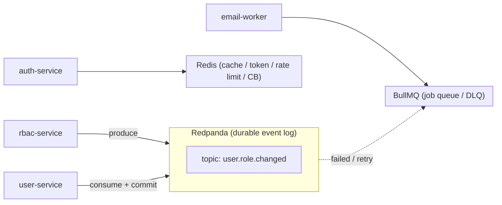

# Task 10: Evolusi Event Bus ke Redpanda (Modular & Configurable)

## Tujuan

Mengganti/menambah Redis Pub/Sub sebagai event bus utama dengan **Redpanda** sebagai durable event log, tanpa merusak existing flow. Sistem harus **modular** (mudah ganti provider) dan **configurable** (topic, partition, retention, consumer group via env/registry), dimulai dari event `UserRoleChanged`.

## Latar Belakang

Saat ini event bus pakai `RedisEventHub` (`packages/shared/src/stream/connector.ts`) yang bersifat **Pub/Sub non-persistent**: kalau consumer down saat event dipublish, event hilang. Ini berisiko untuk event kritis seperti `UserRoleChanged` yang mengubah `users.roleId`.

Redpanda dipilih karena:
- Kafka-compatible API → bisa pakai `kafkajs`.
- Single binary, no ZooKeeper, operasional lebih ringan daripada Kafka.
- Durable, replayable, consumer group native, partitioning per `userId`.

Tapi Redpanda **bukan** pengganti Redis untuk cache, token blocklist, rate limiter, atau circuit breaker state.

## Scope

### 1. Modular Event Broker Abstraction

- Buat interface `EventBroker` (atau `EventBus`) di `packages/shared/src/stream/`:
  - `publish<T>(topic: Topic, payload: T): Promise<void>`
  - `subscribe<T>(topic: Topic, handler: (payload: T) => void | Promise<void>, options?): () => void`
  - `close(): Promise<void>`
- Implementasi provider:
  - `InMemoryBroker` — default test/local.
  - `RedisBroker` — wrapper existing `RedisEventHub`.
  - `RedpandaBroker` — KafkaJS-based.
- Factory `getEventBroker()` atau `createEventBroker()` memilih provider dari env `EVENT_BUS_PROVIDER` (`memory|redis|redpanda`).

### 2. Topic Registry & Configuration

- `packages/shared/src/stream/topics.ts` (atau extend `constants/topics.ts`) menyimpan registry:
  - `name` → topic constant (`USER_ROLE_CHANGED`).
  - `partitions` (default 6).
  - `replicationFactor` (default 1 untuk dev, 3 untuk prod).
  - `retention.ms` / `cleanup.policy`.
  - `partitionKey` function dari payload (misal `payload.userId`).
- Registry dibaca saat startup untuk auto-create topic via Redpanda admin client.
- Env override: `REDPANDA_TOPIC_<NAME>_PARTITIONS`, `REDPANDA_TOPIC_<NAME>_RETENTION_MS`.

### 3. Redpanda Infrastructure

- Tambahkan service `redpanda` ke `docker-compose.ha.yml` (dan `docker-compose.test.yml` jika perlu).
- Update `.env.example` dan `.env.ha.example`:
  - `EVENT_BUS_PROVIDER=redpanda`
  - `KAFKA_BROKERS=localhost:19092`
  - `KAFKA_CLIENT_ID`
  - `KAFKA_CONSUMER_GROUP_ID`
  - `KAFKA_TLS_*` (opsional untuk prod).
- Pastikan topic auto-create aktif di Redpanda, tapi aplikasi tetap mencoba create topic di startup.

### 4. Integrasi `UserRoleChanged`

- `rbac-service` publish `UserRoleChanged` lewat `EventBroker` abstraction, bukan `broadcast()` langsung.
- `user-service` consume via `EventBroker` dengan consumer group `user-service`.
- Partition key = `userId` supaya event per user terurut.
- Gunakan `VersionedEvent` envelope sebagai message value.
- Simpan idempotency key di Redis/DB, jangan hanya in-memory Map.

### 5. Transactional Outbox (Fase 2, opsional tapi direkomendasikan)

- Tambahkan tabel `event_outbox` di `packages/database` (atau per-service):
  - `id`, `topic`, `payload` (JSON), `status` (`pending`/`sent`/`failed`), `retry_count`, `created_at`, `sent_at`.
- `rbac-service` `changeUserRole` menulis `users` update + `event_outbox` dalam satu transaction.
- Background worker / poller membaca `event_outbox` dan publish ke Redpanda, lalu mark `sent`.
- Ini menjamin **atomic publish** — event tidak hilang meski service crash.

### 6. Graceful Shutdown & Error Handling

- `RedpandaBroker.close()` disconnect producer & consumer saat `SIGTERM`/`SIGINT`.
- Consumer harus commit offset hanya setelah handler sukses (at-least-once).
- Jika handler gagal setelah max retry, kirim ke topic DLQ atau BullMQ dead-letter worker.

### 7. Tests

- Unit test `RedpandaBroker` dengan `kafkajs` mock (tanpa real Redpanda).
- Integration test dengan testcontainer Redpanda (opsional, tergantung CI).
- Regression test: `UserRoleChanged` flow tetap bekerja saat `EVENT_BUS_PROVIDER=memory`.
- Update `token-blocklist` / discovery tests jika ada perubahan cross-cutting.

## Checklist

- [x] `EventBroker` abstraction + `InMemoryBroker`, `RedisBroker`, `RedpandaBroker`.
- [x] Topic registry & config override via env.
- [x] Redpanda container di `docker-compose.ha.yml` dan env variables di `.env.example`/`.env.ha.example`.
- [x] `UserRoleChanged` publish/consume via Redpanda dengan idempotency persistent.
- [x] Graceful shutdown untuk Redpanda producer/consumer.
- [x] Unit test + integration test minimal.
- [ ] Transactional outbox (fase 2, dipisah task tersendiri). Jalankan `bun run typecheck` dan `bun test`.

## Keputusan yang Perlu Dipilih

### 1. Client library

- **A. `kafkajs`** — paling populer, Kafka-compatible, works on Bun/Node. Risiko: Bun compatibility perlu diverifikasi.
- **B. `node-rdkafka`** — native binding, performa tinggi. Risiko: build complexity, binary dependency.

**Rekomendasi arsitek: A** untuk iterasi cepat. Ganti ke B hanya jika `kafkajs` tidak stabil di Bun.

### 2. Idempotency store

- **A. Redis** — cepat, tapi sama-sama bergantung Redis. Cocok untuk short-window idempotency.
- **B. Database `idempotency_keys` table** — persistent, survive restart/scale, tapi tambah beban DB.

**Rekomendasi arsitek: B** untuk `UserRoleChanged` karena kritis; A boleh untuk event non-kritis.

### 3. Publish pattern

- **A. Fire-and-forget langsung ke Redpanda** — simple, tapi bisa kehilangan event saat crash.
- **B. Transactional outbox** — paling andal, tapi tambah tabel + poller.

**Rekomendasi arsitek: A untuk fase 1** agar cepat bisa diuji; **B untuk fase 2** sebelum masuk production.

## Dampak

- Event antar service menjadi durable, replayable, dan lebih mudah di-debug.
- Consumer dapat di-scale horizontal dengan consumer group.
- Shared DB coupling tetap ada; Redpanda tidak memperbaiki data ownership, hanya membuat perubahan data lebih andal disampaikan.
- Menambah 1 infrastructure component (Redpanda cluster) di production.

## Referensi

- `docs/rules/01_architecture.md`
- `packages/shared/src/stream/connector.ts`
- `packages/shared/src/constants/topics.ts`
- `apps/rbac-service/src/modules/access/service/access.service.ts`
- `apps/user-service/src/events/user-role-changed.consumer.ts`
- `docker-compose.ha.yml`
- `.env.ha.example`
